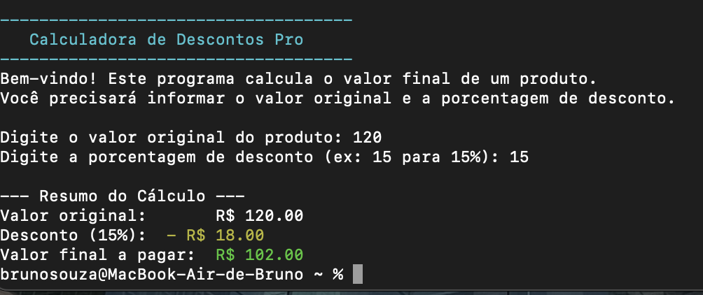

# 🧮 Calculadora de Descontos (CLI)

Pequeno app de linha de comando que calcula o preço final com desconto.

## Como executar
No terminal, dentro da pasta do projeto, rode:

    python calculadora_desconto.py

Em alguns Macs:

    python3 calculadora_desconto.py

## Exemplo

Entrada: 120 e 15 → Saída: 102

## 📌 Roadmap (próximos passos)
- [ ] Tratar casas decimais e separador de milhar automaticamente
- [ ] Modo “lote”: calcular descontos para vários valores de uma vez (ler de .txt/.csv)
- [ ] Parâmetros por linha de comando (`--valor 100 --desconto 15`)
- [ ] Testes automatizados simples (`pytest`)
- [ ] Empacotar como módulo (`pipx`/`poetry`) e, no futuro, publicar no PyPI

# python3 calculadora_desconto.py

